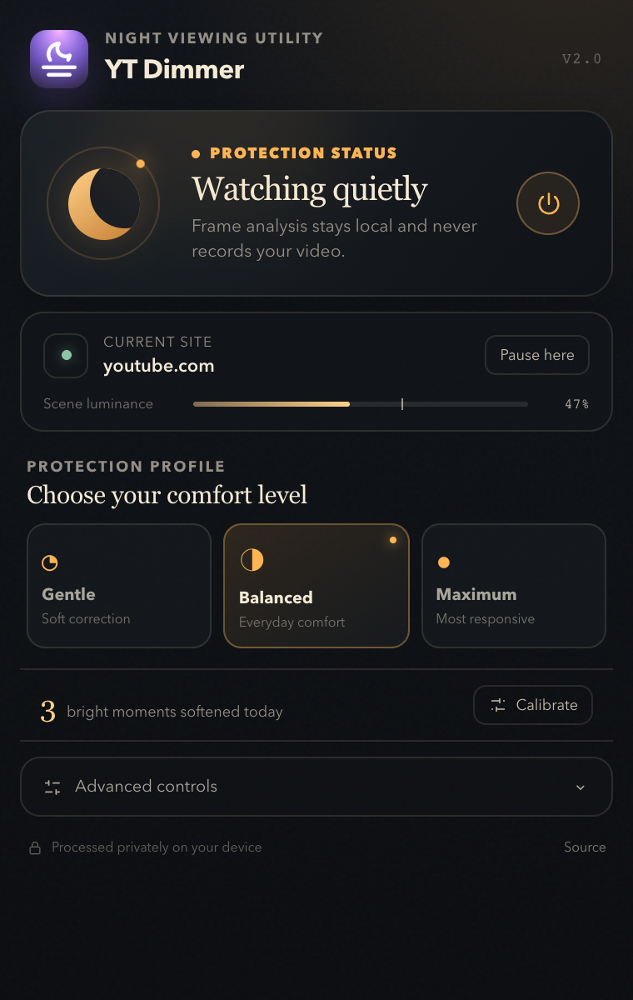
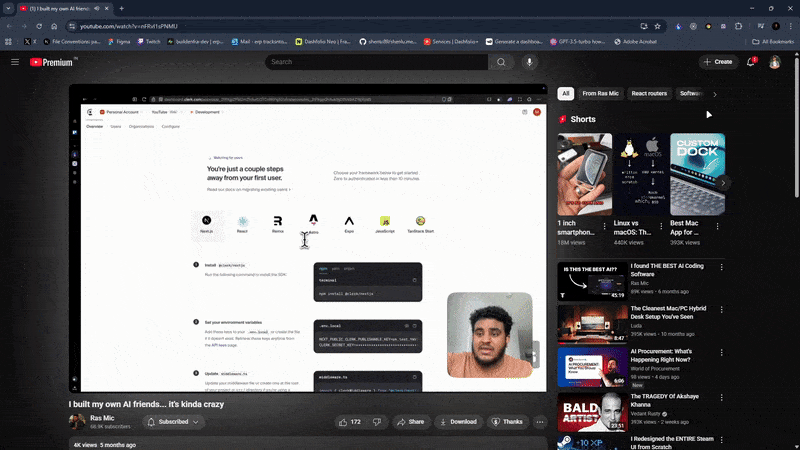

# YT Dimmer



<details>
<summary>See protection in action</summary>



</details>

YT Dimmer is a privacy-first browser extension that softens sudden flashes and
sustained bright video scenes. It is designed for more comfortable late-night
viewing on YouTube, Twitch, Vimeo, and other sites that use HTML video.

> YT Dimmer is a viewing-comfort tool, not a medical device or a substitute for
> medical guidance, platform accessibility controls, or photosensitivity-safe
> content.

## What version 2 adds

- Temporal flash detection using changes between recent frames
- Bright-region and peak-luminance analysis, not only average brightness
- Fast dimming with gradual recovery and hysteresis
- Efficient video-frame scheduling with `requestVideoFrameCallback`
- Dominant-video selection for pages containing several players
- Gentle, Balanced, and Maximum protection profiles
- Per-site pause controls and a global keyboard shortcut
- Optional night-time protection boost that preserves manual settings
- Live scene-luminance status and local daily activation count
- A visual comfort calibration flow
- Import, export, and reset controls

All frame analysis happens in the current browser tab. Video frames are never
recorded, stored, or transmitted.

## Install for development

Requirements: Node.js 20+ and pnpm.

```bash
git clone https://github.com/C-W-D-Harshit/ytdimmer.git
cd ytdimmer
pnpm install
pnpm build
```

Then open `chrome://extensions`, enable Developer mode, choose **Load unpacked**,
and select `.output/chrome-mv3`.

Firefox can be built with:

```bash
pnpm build:firefox
```

## Commands

| Command | Purpose |
| --- | --- |
| `pnpm dev` | Run WXT development mode |
| `pnpm compile` | Type-check the project |
| `pnpm test` | Run detector tests |
| `pnpm build` | Build the Chrome MV3 extension |
| `pnpm build:firefox` | Build the Firefox extension |
| `pnpm zip` | Create a Chrome release archive |

The default quick-toggle shortcut is **Alt + Shift + D**. Browser shortcut
settings can override it.

## Architecture

```text
entrypoints/background.ts   settings initialization and keyboard command
entrypoints/content.ts      video discovery, frame scheduling, and dimming
entrypoints/popup/           React popup and controls
lib/detector.ts             pure temporal/spatial detector
lib/settings.ts             version 2 settings model and helpers
```

The detector is documented in [ALGORITHM.md](ALGORITHM.md). Privacy behavior is
documented in [PRIVACY.md](PRIVACY.md).

## Known compatibility limit

Some sites serve protected cross-origin video that blocks canvas pixel reads.
YT Dimmer detects this condition and leaves the player untouched instead of
claiming active protection. Browser-internal pages cannot run content scripts.

## Contributing

See [CONTRIBUTING.md](CONTRIBUTING.md). Bug reports and focused test cases are
especially valuable for unusual players and scene transitions.

## License

MIT — see [LICENSE](LICENSE).
